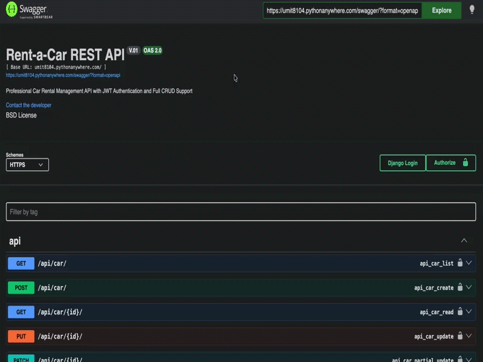

<p align="center">
  
  
  
  
</p>

<h1 align="center">🚗 Rent A Car REST API</h1>

<p align="center"><strong>A professional car rental management system with dynamic availability tracking and automated API documentation 🚀</strong></p>

<div align="center">
  <h3>
    <a href="https://umit8104.pythonanywhere.com/swagger/">
      🖥️ Live Demo (Swagger)
    </a>
     | 
    <a href="https://github.com/umitarat-dev/rent-a-car-rest-api">
      📂 Repository
    </a>
  </h3>
</div>

<p align="center">
  <a href="https://umit8104.pythonanywhere.com/swagger/">
    
  </a>
</p>

## 📚 Navigation
- [🚀 Live API Documentation](#-live-api-documentation)
- [📦 Key Features](#-key-features)
- [🛠️ Built With](#️-built-with)
- [⚙️ Setup & Installation](#️-setup--installation)
- [📬 Contact Information](#-contact-information)

## 🚀 Live API Documentation
The API is fully documented and interactive. Authentication is required for car and reservation operations.
* **Swagger UI:** [https://umit8104.pythonanywhere.com/swagger/](https://umit8104.pythonanywhere.com/swagger/)
* **ReDoc:** [https://umit8104.pythonanywhere.com/redoc/](https://umit8104.pythonanywhere.com/redoc/)

> **Note:** Use the **Authorize** button in Swagger with the format `Token <your_key>` to perform authenticated requests.


## 📦 Key Features
* **Dynamic Availability Tracking:** Real-time car availability calculation based on overlapping reservation dates using advanced Django ORM `annotate` and `Exists` logic.
* **Role-Based Authorization:** Custom permissions for Staff (Inventory Management) and Customers (Personal Reservations).
* **Smart Reservation Validation:** Prevents double-booking for the same user or the same vehicle within conflicting date ranges.
* **Interactive Documentation:** Fully customized Swagger UI with JWT/Token security definitions and HTTPS support for cloud deployment.
* **Environment-Aware Config:** Seamlessly switches between local testing (SQLite) and production (PostgreSQL) environments.


## 🛠️ Built With
* **Core:** [Django 5.2](https://www.djangoproject.com/) & [Django REST Framework](https://www.django-rest-framework.org/)
* **Auth:** [dj-rest-auth](https://dj-rest-auth.readthedocs.io/) with Token Authentication
* **Database:** SQLite (Local) & PostgreSQL (Production Readiness)
* **API Documentation:** [drf-yasg (Swagger/Redoc)](https://drf-yasg.readthedocs.io/)


## ⚙️ Setup & Installation

#### 1. Clone & Environment:

```bash
git clone [https://github.com/umitarat-dev/rent-a-car-rest-api.git](https://github.com/umitarat-dev/rent-a-car-rest-api.git)
cd rent-a-car-rest-api
python -m venv env
source env/bin/activate  # macOS/Linux
# env\Scripts\activate  # Windows
```

#### 2. Configuration:
Create a .env file in the root directory:

```bash
SECRET_KEY=your_secret_key_here
ENV_NAME=dev
DEBUG=True
```

#### 3. Install & Run:

```bash
pip install -r requirements.txt
python manage.py migrate
python manage.py runserver
```


## 📬 Contact Information

I am always open to discussing new projects, creative ideas, or opportunities to be part of your visions.

* **LinkedIn:** [linkedin.com/in/umit-arat](https://www.linkedin.com/in/umit-arat/)
* **Email:** [umitarat8098@gmail.com](mailto:umitarat8098@gmail.com)
* **GitHub:** [github.com/umitarat-dev](https://github.com/umitarat-dev) (Current Workspace)
